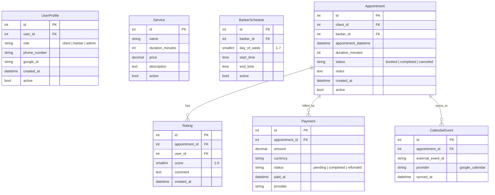

# Proyecto: Barbershop Booking API

Autores: [Nombres de los integrantes aquí]
Fecha: 2025-11-02
Repositorio: https://github.com/jaramillooo/barbershop

---

## 1. Definición del Proyecto y Objetivo (20 pts)

- Claridad del objetivo (10):
  - Construir una API para gestionar reservas de una barbería: clientes, barberos, horarios, citas, pagos y calificaciones.
  - La API expone endpoints REST y documentación Swagger para facilitar pruebas desde navegador (Swagger UI) o Postman.

- Alcance inicial (MVP) (5):
  - Usuarios con roles (cliente, barber, admin) vía `UserProfile`.
  - Catálogo de servicios (sin vincular obligatoriamente en la cita del MVP; la cita almacena duración en minutos).
  - Horarios de barbero (disponibilidad semanal por día y rango horario).
  - Citas cliente↔barbero: crear, listar, actualizar estado.
  - Calificaciones/ratings de citas completadas.
  - Pagos asociados a la cita (monto, moneda, estado, proveedor).
  - Eventos de calendario externos (id externo, proveedor) para futuras integraciones.

- Originalidad o relevancia (5):
  - Necesidad real para negocios locales con gestión simple de citas.
  - Extensible a recordatorios (SMS/WhatsApp), integración con Google Calendar o cobros online.

---

## 2. Modelo Entidad-Relación (25 pts)

- Entidades y relaciones (10):
  - UserProfile 1–1 User.
  - BarberSchedule N–1 User (barbero).
  - Appointment N–1 User (cliente), N–1 User (barbero).
  - Rating N–1 Appointment y N–1 User.
  - Payment N–1 Appointment.
  - CalendarEvent N–1 Appointment.
  - Service: catálogo independiente (MVP sin FK directa en Appointment; se podrá añadir en iteraciones posteriores).

- Normalización y consistencia (10):
  - Sin dependencias transitivas innecesarias ni redundancias: pagos/calificaciones/eventos referencian a `Appointment`; usuario y rol en `UserProfile`; disponibilidad en `BarberSchedule`.

- Diagrama ER (5):

Notas:
- `day_of_week` en `BarberSchedule` va de 1 a 7 (coincide con validaciones del modelo).
- Es válido añadir un FK `service_id` en `Appointment` en una iteración futura (no es requerido en el MVP).

---

## 3. Implementación de Modelos en Django (25 pts)

- Modelos en `barbershop/models.py` (10): ya implementados según el ER descrito (UserProfile, Service, BarberSchedule, Appointment, Rating, Payment, CalendarEvent).
- Relaciones (10): FKs y choices aplicadas con validaciones (`MinValueValidator`, `MaxValueValidator`).
- Migraciones (5):
  - Generar y aplicar:
    - `python manage.py makemigrations`
    - `python manage.py migrate`
  - En Docker (recomendado por configuración de Postgres):
    - `docker compose run --rm web python manage.py makemigrations`
    - `docker compose run --rm web python manage.py migrate`

---

## 4. API con Django REST Framework (20 pts)

- Serializers y Viewsets (10):
  - Archivo: `barbershop/serializers.py` con `ModelSerializer` para todas las entidades.
  - `UserSerializer` maneja contraseña de forma segura (write-only, set_password en create/update).
  - Validaciones de negocio: horario (fin > inicio), cita (cliente ≠ barbero, duración positiva).
  - Viewsets en `barbershop/views.py` con `select_related`/`prefetch_related` y filtros (django-filter), búsqueda y ordenación.

- Rutas y Swagger (10):
  - Router en `barbershop/urls.py`.
  - Swagger UI: `/api/swagger/` | ReDoc: `/api/redoc/` | JSON: `/api/openapi.json`.

---

## 5. Claridad de código en GitHub (10 pts)

- Estructura por app, serializers y viewsets separados, rutas con router, configuración DRF en settings.
- Estilo: nombres explícitos, validaciones en serializer, filtros declarados por vista.
- README con instrucciones y diagrama; este documento sirve para exportar a PDF.

---

## Evidencias y Entrega

- PDF: Exportar este archivo a PDF (VS Code extensión "Markdown PDF" o desde GitHub → abrir raw → imprimir a PDF).
- Capturas sugeridas (Swagger/Postman):
  1) Swagger UI `/api/swagger/` cargado.
  2) `GET /api/services/` (200 OK).
  3) `POST /api/appointments/` (201 Created) con cuerpo mínimo.
  4) `GET /api/appointments/?client=...&barber=...` con filtros.
  5) `POST /api/ratings/` para una cita completada.

- Cómo correr:
  - Docker (recomendado): `docker compose up --build` (según `docker-compose.yml` del repo). Asegúrate que el servicio DB esté disponible como `db`.
  - Local (opcional):
    - Instala dependencias: `pip install -r requirements.txt`.
    - Configura la base de datos Postgres en `project/settings.py` o usa Docker para la DB.
    - Ejecuta migraciones y `python manage.py runserver`.

- Endpoints principales:
  - `/api/users/` (solo lectura)
  - `/api/profiles/`
  - `/api/services/`
  - `/api/schedules/`
  - `/api/appointments/`
  - `/api/ratings/`
  - `/api/payments/`
  - `/api/calendar-events/`
  - Docs: `/api/swagger/`, `/api/redoc/`

---

## Anexos

- Criterios de evaluación: este documento mapea explícitamente los apartados 1–5.
- Cambios futuros: agregar `service` a `Appointment`, autenticación y permisos por rol, notificaciones y sincronización real con Google Calendar.
